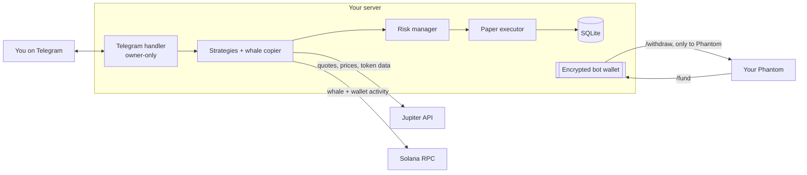

# 🌳 Buttonwood

**A self-hosted Telegram trading companion for Solana.** It watches your Phantom wallet, paper-trades with real market quotes, follows "whale" wallets, judges every strategy and every whale by its actual results, and tells you everything on Telegram.

*Named after the Buttonwood Agreement of 1792, when 24 brokers met under a buttonwood tree and started what became the New York Stock Exchange.*

> [!WARNING]
> **Not financial advice. No profit is promised or implied.** Crypto trading is high risk and automated trading can lose money quickly. Buttonwood currently trades **paper (simulated) money only**. If you ever trade real funds with it, only use money you can afford to lose. You are responsible for your own trades and taxes. See the [LICENSE](LICENSE): the software comes with no warranty.

---

## Features

**📄 Paper trading on real prices**
- A virtual $1,000 account. Every fill uses a **live Jupiter quote**, plus an estimated network fee, so results aren't flattering
- Strategies: **DCA** (buy $X every N hours) and **take-profit / stop-loss** on any position
- Manual `/buy` and `/sell`; trade history; realized and unrealized PnL

**🐋 Whale following**
- Follow any wallet and copy its swaps into the paper account
- **Token safety check** before every copied buy: liquidity, holders, age, mint and freeze authority, holder concentration, and a **buy-then-sell quote** that catches honeypots
- One copy per token per whale; late buys aren't copied; sells always are
- **Copy stop-loss**, and **auto-pause** for whales whose copies lose money
- Measures the real cost of following: seconds behind the whale and how much worse a price you got

**🛡 Risk manager**: every order, from any source, passes through it
- Max trade size, max share of the portfolio in one token, **daily loss limit**, buys per hour, quote-vs-market sanity check
- `/stop` kill switch that survives restarts
- Sells are never blocked by size or loss limits, so a stop-loss can always get you out

**📊 Honest scoreboard**
- `/performance`: results by strategy and whale, compared with **just holding SOL**, and the worst drop from a peak
- Daily report on Telegram
- `/readiness`: a go-live checklist the paper record has to pass before real money is even discussed

**👛 Wallets**
- Watches your **Phantom** wallet and alerts you to any activity
- Its own **encrypted bot wallet** (devnet for now): fund it by scanning a QR code with Phantom; withdrawals can **only** go back to your Phantom address

**🔁 Always on**
- Runs as a systemd service: starts at boot and restarts after crashes
- After downtime it reports how long it was off, whether it crashed, and what it missed: wallet activity, deposits, and DCA buys that came due (bought once, not N times)

## How it works



Phantom never lets an app sign transactions on its own, so Buttonwood uses a **two-wallet model**: Phantom stays your vault, and the bot has its own wallet holding only what you send it. Details in [docs/phantom-integration.md](docs/phantom-integration.md).

## Quick start

**Needs:** Node.js 20.6+ (22+ recommended), a Telegram account, and a Phantom wallet.

```bash
git clone https://github.com/CecuTheMag/Buttonwood.git
cd Buttonwood/apps/bot
npm install
cp .env.example .env
```

1. Create a bot with **@BotFather** in Telegram (`/newbot`) and put the token in `.env` as `TELEGRAM_BOT_TOKEN`.
2. Put your Phantom **Solana address** in `.env` as `OWNER_PHANTOM_ADDRESS`.
3. Start it: `npm run dev`. Send `/start` to your bot: it's in setup mode and replies with your Telegram user ID.
4. Put that ID in `.env` as `TELEGRAM_OWNER_ID` and restart. The bot now answers only you.
5. *(Optional)* Create the bot wallet: `npm run wallet:create`.
6. Try `/help`, `/paper`, `/buy SOL 10`, `/dca SOL 5 24`, `/whale add <address> <name>`.

## Configuration

All settings live in `apps/bot/.env` (never commit it). Trading limits and copy settings are changed from Telegram (`/limits`, `/copy`) and stored in the database.

| Variable | Required | Default | |
|---|---|---|---|
| `TELEGRAM_BOT_TOKEN` | ✅ | | From @BotFather. Secret. |
| `TELEGRAM_OWNER_ID` | ✅ | | Your numeric Telegram ID. Empty = setup mode. |
| `OWNER_PHANTOM_ADDRESS` | ✅ | | Watched wallet, and the **only** withdrawal destination |
| `SOLANA_RPC_URL` | | public mainnet | A [Helius](https://helius.dev) or QuickNode URL is strongly recommended for whale following |
| `BOT_WALLET_NETWORK` | | `devnet` | `devnet` or `mainnet` |
| `BOT_WALLET_RPC_URL` | | per network | |
| `BOT_KEY_PASSPHRASE` | | | Written by `npm run wallet:create`. Secret. |
| `BOT_WALLET_FILE` | | `data/bot-wallet.enc.json` | |
| `DB_FILE` / `STATE_FILE` | | `data/…` | |
| `JUPITER_API_URL` | | `https://lite-api.jup.ag` | |
| `REPORT_HOUR_UTC` | | `20` | When the daily report is sent |

## Running on a server

```bash
echo 'DEPLOY_HOST=you@your-server' > deploy/.env   # git-ignored
./deploy/push.sh --install                         # first time: copies code, installs Node if needed, sets up systemd
ssh you@your-server 'cd ~/buttonwood/apps/bot && npm run wallet:create'   # once
./deploy/push.sh                                   # every update after that (no sudo)
```

`push.sh` never overwrites the server's `.env` or `data/`. Logs: `journalctl -u buttonwood -f`. Run **one** copy of the bot at a time: Telegram delivers updates to only one.

> **Back up** `data/bot-wallet.enc.json` and `BOT_KEY_PASSPHRASE`, **kept apart from each other**. Lose both and the bot wallet's funds are gone; leak both and anyone can take them.

## Commands

The essentials are below; the full reference is in [docs/telegram-bot.md](docs/telegram-bot.md).

| | |
|---|---|
| `/paper` · `/performance` · `/readiness` · `/report` | Portfolio, results, go-live checklist, daily report |
| `/buy SOL 10` · `/sell SOL 50` | Manual paper trades |
| `/dca SOL 5 24` · `/tpsl SOL 15 8` · `/strategies` | Strategies |
| `/whale add <addr> <name>` · `/whales` · `/copy` | Whale following |
| `/limits` · `/stop` · `/resume` | Risk controls |
| `/balance` · `/fund` · `/withdraw` · `/transfers` | Wallets |
| `/status` · `/help` | Health, help |

## Development

```bash
cd apps/bot
npm run dev         # run locally, restart on changes
npm test            # unit tests: strategies, risk manager, accounting, swap parser, performance math
npm run typecheck
```

### Project layout

```
apps/bot/
├── src/
│   ├── index.ts            startup, offline catch-up, timers (engine 60s, whales 20s, heartbeat 30s)
│   ├── telegram.ts         bot setup, owner guard, wallet commands
│   ├── commands/           trading.ts, whales.ts: Telegram commands
│   ├── trading/
│   │   ├── engine.ts       order placement, paper fills, portfolio valuation
│   │   ├── risk.ts         risk checks (pure)
│   │   ├── strategies.ts   DCA, TP/SL (pure)
│   │   ├── accounting.ts   average-cost positions (pure)
│   │   ├── swapParser.ts   reads a wallet's swaps from a transaction (pure)
│   │   ├── whales.ts       whale polling, copying, stop-loss, auto-pause
│   │   ├── tokenInfo.ts    token safety check
│   │   ├── performance.ts  stats, drawdown, readiness gate, daily report
│   │   ├── jupiter.ts      quote client
│   │   └── store.ts        SQLite tables and queries
│   ├── botWallet.ts        encrypted bot wallet, deposits, withdrawals
│   ├── watcher.ts          Phantom wallet activity
│   └── keystore.ts         AES-256-GCM + scrypt key encryption
├── scripts/create-wallet.ts
└── test/
deploy/                     push.sh (deploy), install.sh (systemd service)
docs/                       guides and design docs
```

## Documentation

| Doc | |
|---|---|
| [Concepts](docs/concepts.md) | Wallets, keys, Solana, swaps and slippage, for beginners |
| [Telegram bot](docs/telegram-bot.md) | Setup, every command, notifications, security rules |
| [Whale following](docs/whale-following.md) | How copying works, the safety check, auto-pause, the go-live gate |
| [Security & risk](docs/security-and-risk.md) | Protecting keys, and how trading bots lose money |
| [Architecture](docs/architecture.md) · [Trading engine](docs/trading-engine.md) · [Phantom integration](docs/phantom-integration.md) | Design |
| [Roadmap](docs/roadmap.md) · [Ideas](docs/ideas.md) | What's done, what's next |

## Status

✅ Phantom watching · ✅ bot wallet (devnet) · ✅ paper trading + strategies · ✅ whale following · ⏳ **real-money execution is not built yet, on purpose.** It comes after the paper record passes `/readiness`. See the [roadmap](docs/roadmap.md).

## Security

Found a vulnerability? Please report it privately; see [SECURITY.md](SECURITY.md).

## License

[MIT](LICENSE). Third-party packages and their licenses are listed in [THIRD_PARTY_LICENSES.md](THIRD_PARTY_LICENSES.md).
