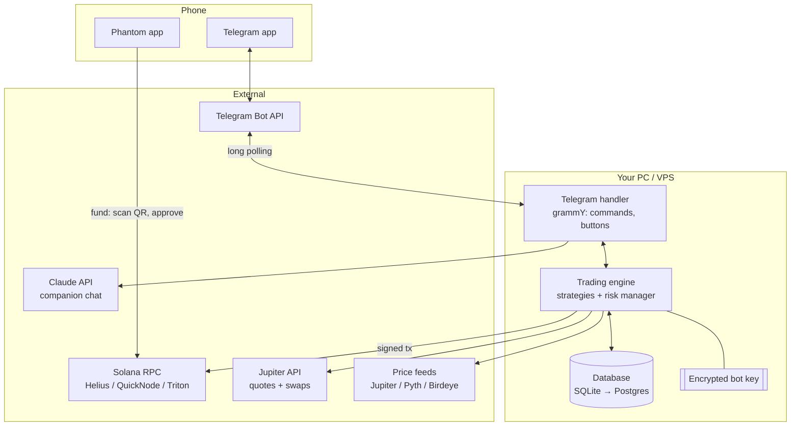
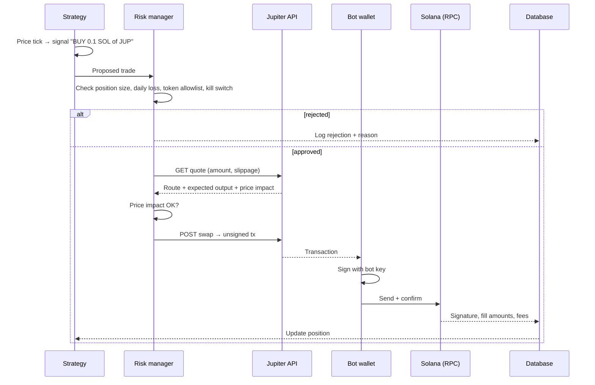

# Architecture

> This page describes the overall design. For what is built today, see the [README](../README.md#project-layout).

## Big picture

Buttonwood has three main parts, and Telegram is how you talk to them:



| Part | Job | Holds secrets? |
|------|-----|----------------|
| **Telegram handler** | Your remote control: commands, confirm buttons, notifications, AI chat. Only answers your Telegram user ID | Telegram bot token |
| **Trading engine** | Watches prices, runs strategies, checks risk limits, signs and sends swaps | **Yes, the bot wallet key** |
| **Database** | Settings, trades, PnL snapshots, logs | No keys |

Both run in **one Node process**. A web dashboard or Telegram Mini App can be added later (see [telegram-bot.md](telegram-bot.md#later-a-telegram-mini-app)).

## The two wallets

| | Phantom wallet | Bot wallet |
|---|---|---|
| Who controls it | You (approve every tx) | The bot worker (signs automatically) |
| Holds | Your main funds | Only what you deposit for trading |
| Created by | Phantom | Buttonwood, on first run |
| Key stored | In Phantom, on your device | Encrypted on the server (see [security](security-and-risk.md)) |
| Can withdraw to | Anywhere | **Only your Phantom address** (hard-coded allowlist) |

## Life of a trade



## Tech stack (recommended)

Use **TypeScript everywhere**. The Solana and Phantom ecosystems are JavaScript-first, and one language is easier to learn.

| Layer | Choice | Why |
|-------|--------|-----|
| Interface | **Telegram bot via grammY** | TypeScript-first, great docs, buttons and menus built in |
| Funding from Phantom | Solana Pay QR code (`qrcode` package) | Phantom scans it, no web page needed |
| Web UI (later) | Next.js + `@solana/wallet-adapter-react` | For a Mini App or dashboard with charts |
| Solana library | `@solana/web3.js` v1 (most examples) or `@solana/kit` (its modern successor) | Building and sending transactions |
| Bot worker | Node.js + `tsx`, run with `pm2` or Docker | Simple long-running process |
| Swaps | Jupiter Swap API | Best price across all Solana DEXs |
| Prices | Jupiter Price API, plus Pyth for majors | Free, reliable |
| RPC | Helius or QuickNode (free tier to start) | Public RPC is rate-limited and unreliable for bots |
| Database | SQLite via Drizzle or Prisma; Postgres later | Zero setup to start |
| AI companion | Claude API (`claude-sonnet-5`) | Explains trades, answers questions about your portfolio |

**Python alternative:** if you'd rather write the bot in Python, use `solana-py` + `solders` + `python-telegram-bot` (or `aiogram`). The Jupiter flow is identical since it's just HTTP.

## Proposed folder structure

```
buttonwood/
├── apps/
│   ├── bot/                  # Telegram bot + trading engine (one process)
│   │   ├── src/
│   │   │   ├── index.ts      # starts Telegram + trading loop
│   │   │   ├── telegram.ts   # commands, buttons, owner-only guard
│   │   │   ├── companion.ts  # AI chat (Claude API)
│   │   │   ├── withdraw.ts   # bot → Phantom only
│   │   │   ├── wallet.ts     # load/decrypt bot keypair
│   │   │   ├── jupiter.ts    # quote + swap
│   │   │   ├── prices.ts     # price feeds
│   │   │   ├── risk.ts       # risk manager
│   │   │   ├── executor.ts   # paper vs live execution
│   │   │   └── strategies/
│   │   │       ├── types.ts
│   │   │       ├── dca.ts
│   │   │       ├── tpsl.ts   # take-profit / stop-loss
│   │   │       └── grid.ts
│   │   └── test/
│   └── web/                  # (later) Mini App / dashboard
├── packages/
│   └── shared/               # types, token list, constants (mints, decimals)
├── docs/
├── .env.example              # names of env vars, never real values
└── README.md
```

## Configuration (`.env`)

```bash
# .env.example: copy to .env and fill in. .env must be in .gitignore.
SOLANA_RPC_URL=https://mainnet.helius-rpc.com/?api-key=YOUR_KEY
JUPITER_API_URL=https://lite-api.jup.ag      # check dev.jup.ag for the current base URL
OWNER_PHANTOM_ADDRESS=                        # the ONLY address the bot may withdraw to
BOT_KEY_PASSPHRASE=                           # decrypts the bot keypair file
TRADING_MODE=paper                            # paper | live
TELEGRAM_BOT_TOKEN=                           # from @BotFather, a secret
TELEGRAM_OWNER_ID=                            # your numeric user ID; the bot ignores everyone else
ANTHROPIC_API_KEY=
DATABASE_URL=file:./buttonwood.db
```

## Where to run it

| Option | Pros | Cons |
|--------|------|------|
| Your own PC | Free, simple | Stops when the PC sleeps |
| Raspberry Pi / home server | Cheap, always on | Some setup |
| Small VPS (Hetzner, DigitalOcean, ~$5/mo) | Always on, low latency | You must secure the server |
| Vercel / serverless | Fine for a later web UI | Not suitable for the bot (needs to run continuously) |

Start on your own PC in **paper mode**. Move to a VPS when you go live.
