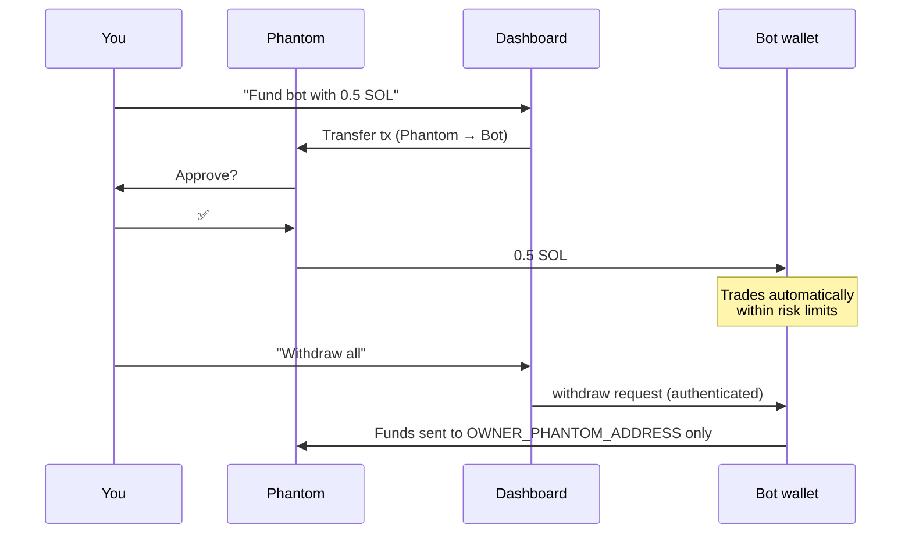
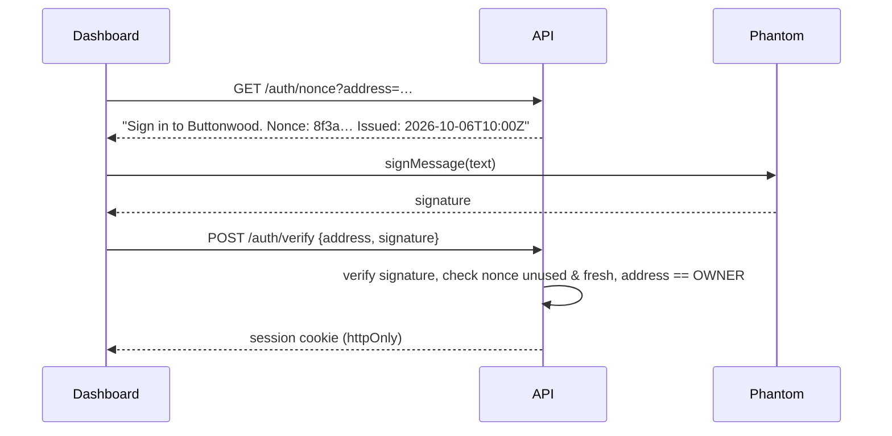

# Phantom integration

> This page covers the design options. Buttonwood currently uses the two-wallet model with QR-code funding (see [telegram-bot.md](telegram-bot.md)). The web-dashboard sections are for a future Mini App.

## What an app can and can't do with Phantom

| ✅ An app **can** | ❌ An app **cannot** |
|---|---|
| Ask to connect and learn your public address | See your private key or seed phrase |
| Read your balances (actually read from the blockchain, not from Phantom) | Sign anything without a popup you approve |
| Ask you to sign a transaction | Get "standing permission" to trade |
| Ask you to sign a message (used for login) | Move funds while Phantom is locked or closed |

So "a bot that trades for me via Phantom" has to be one of the designs below.

> **Buttonwood is a Telegram bot.** For the MVP you only need [Option B](#option-b-two-wallet-model-fully-automatic--recommended) plus [funding via QR code](#funding-from-telegram-qr-code). Steps 1–3 (connecting Phantom to a web page) only matter once you add a web dashboard or Telegram Mini App.

---

## Three ways to design it

### Option A: Approve mode (semi-automatic)

The bot finds trades, and **you approve each one** in Phantom.

```
Bot: "Signal: buy 0.2 SOL of JUP (RSI oversold). [Review]"
You: click → Phantom popup → Approve
```

- ✅ Safest. Funds never leave Phantom, and there's no bot key to protect.
- ❌ Not automatic. You have to be at your device, and you'll miss fast moves.
- 👉 **Good first version**, and a good permanent mode for big trades.

### Option B: Two-wallet model (fully automatic) ⭐ recommended

Buttonwood creates its **own bot wallet**. You send it a capped amount from Phantom. The bot signs trades itself, 24/7. It can only send funds back to your Phantom address.



- ✅ Truly automatic. Your main Phantom funds are never at risk from the bot.
- ❌ You must protect the bot's key (see [security](security-and-risk.md)). Whatever is in the bot wallet is at risk.
- 👉 **The main design for Buttonwood.**

### Option C: Hybrid (the best long-term UX)

Combine A and B: small, routine trades (DCA, stop-losses) run automatically in the bot wallet, and anything above a threshold (say $100) goes to you for approval in Phantom.

> **Also worth checking:** Phantom has been shipping developer SDKs (embedded wallets, "Phantom Connect", server-side tooling). Read [docs.phantom.com](https://docs.phantom.com) before you build. If they now offer a supported way to grant a scoped, revocable trading permission, it could replace the bot-wallet approach. Never rely on an unofficial trick to get around Phantom's approval popup.

---

## Funding from Telegram: QR code

The simplest flow, with no web page at all:

1. Send `/fund` to the bot.
2. The bot replies with its address and a QR code (a Solana Pay URL: `solana:<botAddress>?label=Buttonwood`).
3. In Phantom mobile, tap the scan icon and scan the QR code (or copy the address into *Send*).
4. Enter the amount, then approve in Phantom.
5. The bot notices the deposit and messages you: "💰 Received 0.5 SOL".

Withdrawing is `/withdraw` and then ✅ Confirm. Funds go to `OWNER_PHANTOM_ADDRESS` from `.env`, which is set once by you. See [Step 4](#step-4-withdraw-bot--phantom) for the code.

---

## Step 1: Connect Phantom (web UI, later)

### Easiest: Solana Wallet Adapter (React)

Phantom implements the **Wallet Standard**, so the adapter finds it automatically.

```bash
npm i @solana/web3.js @solana/wallet-adapter-react @solana/wallet-adapter-react-ui @solana/wallet-adapter-base
```

```tsx
// apps/web/app/providers.tsx
'use client';
import { ConnectionProvider, WalletProvider } from '@solana/wallet-adapter-react';
import { WalletModalProvider } from '@solana/wallet-adapter-react-ui';
import '@solana/wallet-adapter-react-ui/styles.css';

export function Providers({ children }: { children: React.ReactNode }) {
  return (
    <ConnectionProvider endpoint={process.env.NEXT_PUBLIC_RPC_URL!}>
      {/* Empty array: Wallet Standard wallets like Phantom are auto-detected */}
      <WalletProvider wallets={[]} autoConnect>
        <WalletModalProvider>{children}</WalletModalProvider>
      </WalletProvider>
    </ConnectionProvider>
  );
}
```

```tsx
// Anywhere in the UI
import { WalletMultiButton } from '@solana/wallet-adapter-react-ui';
import { useWallet } from '@solana/wallet-adapter-react';

export function Header() {
  const { publicKey } = useWallet();
  return (
    <header>
      <WalletMultiButton />
      {publicKey && <span>Connected: {publicKey.toBase58().slice(0, 4)}…</span>}
    </header>
  );
}
```

### Manual: Phantom's injected provider

Useful for understanding what's happening under the hood:

```ts
const provider = (window as any).phantom?.solana;
if (!provider?.isPhantom) {
  window.open('https://phantom.app/', '_blank'); // not installed
} else {
  const { publicKey } = await provider.connect(); // popup
  console.log('Connected', publicKey.toString());
}
```

---

## Step 2: Sign in with Phantom (prove it's really you)

Connecting only tells the dashboard your address, and anyone can *claim* an address. To log in to the **API server** (which can trigger withdrawals), prove ownership by signing a one-time message.



```ts
// Browser
const { publicKey, signMessage } = useWallet();
const { message } = await fetch(`/api/auth/nonce?address=${publicKey}`).then(r => r.json());
const signature = await signMessage!(new TextEncoder().encode(message));
await fetch('/api/auth/verify', {
  method: 'POST',
  headers: { 'Content-Type': 'application/json' },
  body: JSON.stringify({ address: publicKey!.toBase58(), signature: bs58.encode(signature) }),
});
```

```ts
// Server
import nacl from 'tweetnacl';
import bs58 from 'bs58';

const ok = nacl.sign.detached.verify(
  new TextEncoder().encode(storedMessageForThisNonce),
  bs58.decode(signature),
  bs58.decode(address),
);
if (!ok || address !== process.env.OWNER_PHANTOM_ADDRESS) throw new Error('unauthorized');
// mark nonce as used so it can't be replayed
```

> Signing a message is **free** and **can't move funds**. Phantom shows it as plain text.

---

## Step 3: Fund the bot wallet (Phantom → bot)

The dashboard builds a transfer and Phantom asks you to approve it.

```tsx
import { useConnection, useWallet } from '@solana/wallet-adapter-react';
import { LAMPORTS_PER_SOL, PublicKey, SystemProgram, Transaction } from '@solana/web3.js';

export function useFundBot() {
  const { connection } = useConnection();
  const { publicKey, sendTransaction } = useWallet();

  return async (sol: number, botAddress: string) => {
    if (!publicKey) throw new Error('Connect Phantom first');
    const tx = new Transaction().add(
      SystemProgram.transfer({
        fromPubkey: publicKey,
        toPubkey: new PublicKey(botAddress),
        lamports: Math.round(sol * LAMPORTS_PER_SOL),
      }),
    );
    const signature = await sendTransaction(tx, connection); // Phantom popup
    await connection.confirmTransaction(signature, 'confirmed');
    return signature;
  };
}
```

Funding with **USDC** instead of SOL works the same way, using `@solana/spl-token`:
`createAssociatedTokenAccountIdempotentInstruction` (makes sure the bot has a USDC account) followed by `createTransferCheckedInstruction`.

> The bot wallet always needs a little SOL (~0.05) for transaction fees and for opening token accounts (~0.002 SOL each, refundable when closed).

---

## Step 4: Withdraw (bot → Phantom)

This runs **on the server** because it needs the bot key. The destination is never taken from the request. It always comes from config.

```ts
// apps/bot/src/withdraw.ts
import { PublicKey, SystemProgram, Transaction, sendAndConfirmTransaction } from '@solana/web3.js';
import { connection } from './rpc';
import { botKeypair } from './wallet';

const OWNER = new PublicKey(process.env.OWNER_PHANTOM_ADDRESS!);
const FEE_RESERVE = 5_000_000; // keep 0.005 SOL so the bot can still close accounts

export async function withdrawAllSol() {
  const balance = await connection.getBalance(botKeypair.publicKey);
  const lamports = balance - FEE_RESERVE;
  if (lamports <= 0) return null;

  const tx = new Transaction().add(
    SystemProgram.transfer({ fromPubkey: botKeypair.publicKey, toPubkey: OWNER, lamports }),
  );
  return sendAndConfirmTransaction(connection, tx, [botKeypair]);
}
```

**Rules for withdrawals:**

1. Destination = `OWNER_PHANTOM_ADDRESS` only. There's no "send to another address" feature, so even a hacked dashboard can't redirect funds.
2. Requires a valid signed-in session (Step 2).
3. Before withdrawing, sell open positions back to SOL/USDC (or offer to send the tokens as they are).

**Nice extra:** an automatic **profit sweep**. Once a week, send anything above your starting balance back to Phantom, so profits are locked away from the bot.

---

## Mobile

- **Phantom in-app browser:** open the dashboard URL inside Phantom mobile's built-in browser. The wallet adapter just works there.
- **Deep links:** Phantom supports universal links (`https://phantom.app/ul/...`) to open your site inside Phantom. See their docs for the current format.
- **Approvals:** in Option A/C, small approvals happen with Telegram buttons. For trades that should be signed by Phantom itself, the Telegram message links to a page opened in Phantom's browser.

## Useful links

- Phantom developer docs: <https://docs.phantom.com>
- Solana Wallet Adapter: <https://github.com/anza-xyz/wallet-adapter>
- Solana docs: <https://solana.com/docs>
