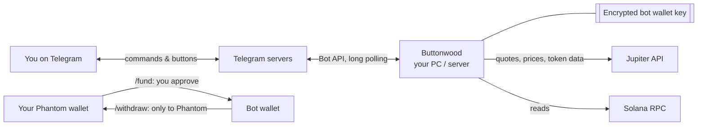

# Telegram bot

Buttonwood's interface is a **Telegram bot**. The bot program runs on your PC or server; Telegram just carries messages between you and it.

## Setup (5 minutes)

1. In Telegram, open **@BotFather**, send `/newbot`, and pick a name and a username (e.g. `my_buttonwood_bot`).
2. BotFather gives you a **token**. Put it in `apps/bot/.env` as `TELEGRAM_BOT_TOKEN`. Treat it like a password.
3. Leave `TELEGRAM_OWNER_ID` empty and start the bot. Send it `/start`: in **setup mode** it replies with your numeric user ID and does nothing else.
4. Put that ID in `.env` as `TELEGRAM_OWNER_ID` and restart. From now on the bot **ignores everyone except you**.
5. **Turn on Telegram two-step verification** (Settings → Privacy and Security). Your Telegram account now controls the bot.

The bot registers its own command menu on startup; no `/setcommands` needed.

## Commands

### Paper trading
| Command | What it does |
|---|---|
| `/paper` | Paper portfolio: value, PnL since start, realized/unrealized, positions |
| `/paper reset 1000` | Start over with $1,000 of paper cash (asks to confirm) |
| `/buy SOL 10` | Paper-buy $10 of SOL at a real Jupiter quote |
| `/sell SOL 50` | Sell 50% of your paper SOL (default 100%) |
| `/dca SOL 5 24` | Strategy: buy $5 of SOL every 24 hours |
| `/tpsl SOL 15 8` | Strategy: sell all SOL at +15% or −8% vs average entry (0 turns a side off) |
| `/strategies` | List strategies with pause / resume / delete buttons |
| `/history` | Last 10 trades |
| `/limits` | Show risk limits · `/limits maxtrade 25` to change one |
| `/stop` · `/resume` | 🛑 Kill switch for all trading (survives restarts) |

### Whale following
| Command | What it does |
|---|---|
| `/autopilot` | Automatic whale finding (on by default): `on` · `off` · `run` · `whales 5` |
| `/candidates` | Wallets the autopilot scored, with their numbers and why |
| `/whale add <address> <name> [usd]` | Follow a wallet yourself; copy `usd` per buy (default from `/copy`) |
| `/whale remove <name>` | Stop following |
| `/whales` | Results per whale: copies, win rate, net PnL, delay and price vs the whale; pause/resume buttons |
| `/copy` | Copy-trading settings · `/copy usd 25`, `/copy liquidity 500000`, … |
| `/performance` | Results by strategy and whale, vs just holding SOL, worst drop from a peak |
| `/readiness` | Go-live checklist (see [whale-following.md](whale-following.md#the-go-live-gate)) |
| `/report` | Today's report now (it's also sent daily at 20:00 UTC) |

### Wallets
| Command | What it does |
|---|---|
| `/balance` | Your Phantom wallet (mainnet, in USD) and the bot wallet |
| `/fund` · `/fund 0.5` | QR code to send SOL from Phantom to the bot wallet |
| `/withdraw` · `/withdraw 0.1` | Send SOL from the bot wallet back to your Phantom address, after a ✅ tap |
| `/transfers` | Recent deposits and withdrawals |
| `/airdrop` | Devnet only: request 1 free test SOL |
| `/status` | Uptime, last downtime, RPC health |
| `/help` | Everything above |

## What it tells you without being asked

- 🔔 Activity on your Phantom wallet (checked every minute)
- 💰 Deposits into the bot wallet
- 📄 Every paper trade, with the reason, route, fee, and remaining cash, and every trade the risk manager blocked
- 🐋 Every copied whale trade, plus how many seconds behind and how much worse a price you got than the whale
- 🐋⏸ A whale auto-paused for losing money
- 🤖 Autopilot scan results: who it started following and why, or why nobody qualified
- ⚠️ A background job (whale following, trading engine, wallet watching, autopilot) failing 5 times in a row, and ✅ when it recovers
- 🗓 A daily report at 20:00 UTC (`REPORT_HOUR_UTC`)
- 🎓 A one-time message when the paper record passes `/readiness`
- 🟢 "Back online" after any restart: how long it was down, whether it crashed, and what it missed

## Downtime and stale commands

Telegram keeps messages sent to a bot for up to 24 hours. When Buttonwood starts it answers them, marked as sent while it was offline. **Money commands** (`/buy`, `/sell`, `/withdraw`) sent while offline are **refused**, because prices have moved, so you must send them again. Confirmation buttons expire after 2 minutes.

## Security rules

1. **Owner only.** Bots are public; Buttonwood silently ignores every user except `TELEGRAM_OWNER_ID`.
2. **No secrets in chat, ever.** No command shows or accepts private keys, seed phrases, or API keys.
3. **Withdrawals only go to `OWNER_PHANTOM_ADDRESS`.** There is no "send to address" command, so even a hijacked Telegram account can only send funds back to *your* wallet.
4. **If the token leaks:** `/revoke` in @BotFather, put the new token in `.env`, restart.
