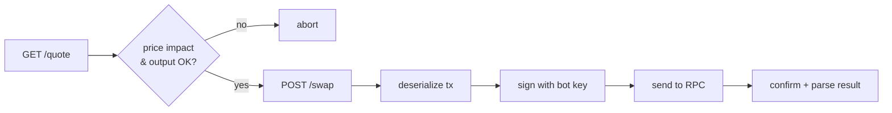

# Trading engine

> This page explains the concepts. The implementation lives in [`apps/bot/src/trading/`](../apps/bot/src/trading/), so code here is illustrative and simplified.

The bot worker is a loop: **get prices → run strategies → check risk → execute → record**.

```ts
// apps/bot/src/index.ts (simplified)
while (running) {
  const prices = await getPrices(watchlist);
  for (const strategy of enabledStrategies) {
    const orders = strategy.onTick({ prices, positions, now: new Date() });
    for (const order of orders) {
      const verdict = risk.check(order, { positions, todaysPnl, balances });
      if (!verdict.ok) { log.reject(order, verdict.reason); continue; }
      const fill = await executor.execute(order);   // paper or live
      await db.recordTrade(fill);
      await notify(fill);
    }
  }
  await sleep(TICK_MS); // e.g. 15–60s; not a high-frequency bot
}
```

---

## 1. Executing a swap with Jupiter

Jupiter does the hard part (routing across DEXs). The flow is just HTTP plus one signature:



```ts
// apps/bot/src/jupiter.ts
import { VersionedTransaction } from '@solana/web3.js';
import { connection } from './rpc';
import { botKeypair } from './wallet';

// ⚠️ Jupiter's base URLs and versions change. Check https://dev.jup.ag before building.
const JUP = process.env.JUPITER_API_URL ?? 'https://lite-api.jup.ag';

export async function getQuote(inputMint: string, outputMint: string, amount: bigint, slippageBps = 50) {
  const url = new URL(`${JUP}/swap/v1/quote`);
  url.search = new URLSearchParams({
    inputMint, outputMint, amount: amount.toString(), slippageBps: String(slippageBps),
  }).toString();
  const res = await fetch(url);
  if (!res.ok) throw new Error(`quote failed: ${res.status} ${await res.text()}`);
  return res.json(); // includes outAmount, priceImpactPct, routePlan
}

export async function swap(quote: any) {
  const res = await fetch(`${JUP}/swap/v1/swap`, {
    method: 'POST',
    headers: { 'Content-Type': 'application/json' },
    body: JSON.stringify({
      quoteResponse: quote,
      userPublicKey: botKeypair.publicKey.toBase58(),
      dynamicComputeUnitLimit: true,
      prioritizationFeeLamports: 'auto',
    }),
  });
  if (!res.ok) throw new Error(`swap build failed: ${res.status}`);
  const { swapTransaction } = await res.json();

  const tx = VersionedTransaction.deserialize(Buffer.from(swapTransaction, 'base64'));
  tx.sign([botKeypair]);

  const signature = await connection.sendRawTransaction(tx.serialize(), { maxRetries: 2 });
  const latest = await connection.getLatestBlockhash();
  const result = await connection.confirmTransaction({ signature, ...latest }, 'confirmed');
  if (result.value.err) throw new Error(`swap failed on-chain: ${JSON.stringify(result.value.err)}`);
  return signature;
}
```

**Always check before swapping:**

- `priceImpactPct` under your limit (e.g. < 1%)
- `outAmount` is sane compared with your own price feed (catches broken routes)
- Never use slippage above ~1–2% for normal tokens

**Jupiter also has built-in order types** (recurring/DCA and trigger/limit orders) that run on-chain. They're worth a look, because they keep working even when your bot is offline.

---

## 2. Strategy interface

Every strategy is a plain object with the same shape, so strategies are easy to add, test, and backtest.

```ts
// apps/bot/src/strategies/types.ts
export type Order = {
  side: 'buy' | 'sell';
  inputMint: string;
  outputMint: string;
  amount: bigint;          // in input token base units
  reason: string;          // human-readable, shown in the journal and AI chat
  strategyId: string;
};

export interface Strategy {
  id: string;
  name: string;
  onTick(ctx: {
    prices: Record<string, number>;   // mint → USD price
    positions: Position[];
    now: Date;
  }): Order[];
}
```

### Starter strategies (simplest first)

| Strategy | Logic | Good for learning because… |
|----------|-------|----------------------------|
| **DCA** | Buy $X of token every N hours | No prediction needed; tests the whole pipeline end to end |
| **Take-profit / stop-loss** | Sell if price ≥ entry × (1 + TP%) or ≤ entry × (1 − SL%) | Protects positions you already hold |
| **Rebalancer** | Keep, for example, 50% SOL / 50% USDC; trade back when the split drifts > 5% | Simple and surprisingly sensible |
| **Grid** | Place buy levels below and sell levels above the current price; profit from chop | Works in sideways markets, loses in strong trends |
| **MA crossover** | Buy when the fast moving average crosses above the slow one, sell on the reverse | Classic intro to signals; easy to backtest |

```ts
// apps/bot/src/strategies/dca.ts
export function dca(opts: { id: string; buyMint: string; usdcPerBuy: number; everyHours: number }): Strategy {
  let lastBuy = 0;
  return {
    id: opts.id,
    name: `DCA ${opts.usdcPerBuy} USDC every ${opts.everyHours}h`,
    onTick({ now }) {
      if (now.getTime() - lastBuy < opts.everyHours * 3_600_000) return [];
      lastBuy = now.getTime();
      return [{
        side: 'buy',
        inputMint: USDC_MINT,
        outputMint: opts.buyMint,
        amount: BigInt(Math.round(opts.usdcPerBuy * 1e6)),
        reason: `Scheduled DCA buy (every ${opts.everyHours}h)`,
        strategyId: opts.id,
      }];
    },
  };
}
```

> In a real build, persist `lastBuy` to the database so a restart doesn't trigger a double buy.

---

## 3. Risk manager

Every order goes through the risk manager. **Strategies propose, the risk manager decides.** This is the most important code in the project.

```ts
// apps/bot/src/risk.ts
export const limits = {
  maxTradeUsd: 25,             // single trade
  maxPositionPctOfBalance: 0.2, // no more than 20% of bot balance in one token
  maxDailyLossUsd: 20,          // stop trading for the day after this
  maxTradesPerHour: 10,
  maxPriceImpactPct: 1,
  allowedMints: new Set([SOL_MINT, USDC_MINT, JUP_MINT /* … */]), // allowlist, not blocklist
};

export function check(order: Order, state: RiskState): { ok: true } | { ok: false; reason: string } {
  if (state.killSwitch) return { ok: false, reason: 'kill switch on' };
  if (!limits.allowedMints.has(order.outputMint)) return { ok: false, reason: 'token not on allowlist' };
  if (state.orderUsd(order) > limits.maxTradeUsd) return { ok: false, reason: 'trade too large' };
  if (state.todaysPnlUsd <= -limits.maxDailyLossUsd) return { ok: false, reason: 'daily loss limit hit' };
  if (state.tradesLastHour >= limits.maxTradesPerHour) return { ok: false, reason: 'rate limit' };
  // …position concentration, min SOL for fees, etc.
  return { ok: true };
}
```

**Must-have controls:**

- 🔴 **Kill switch**: the Telegram `/stop` command halts all trading instantly.
- **Daily loss limit**: auto-pauses and notifies you.
- **Token allowlist**: the bot only trades tokens you approved.
- **Max trade size and position size**
- **Circuit breaker**: pause if 3 trades fail in a row, or if prices from two sources disagree by > 2%.

---

## 4. Paper trading vs live

Use the same strategies and risk checks, and swap only the executor:

```ts
export interface Executor { execute(order: Order): Promise<Fill>; }

// Paper: gets a REAL Jupiter quote, but doesn't send. Records the fill as if it happened.
export const paperExecutor: Executor = {
  async execute(order) {
    const q = await getQuote(order.inputMint, order.outputMint, order.amount);
    return { ...order, outAmount: BigInt(q.outAmount), signature: 'PAPER', at: new Date() };
  },
};

export const liveExecutor: Executor = {
  async execute(order) {
    const q = await getQuote(order.inputMint, order.outputMint, order.amount);
    const signature = await swap(q);
    return { ...order, outAmount: BigInt(q.outAmount), signature, at: new Date() }; // then reconcile with actual on-chain amounts
  },
};

export const executor = process.env.TRADING_MODE === 'live' ? liveExecutor : paperExecutor;
```

> Devnet has no real DEX liquidity, so Jupiter doesn't work there. **Paper trading against real mainnet quotes** is the best way to test strategies. Use devnet only to test transfers (funding and withdrawing).

---

## 5. Backtesting

Before paper trading a strategy, run it against historical candles:

1. Download OHLCV data (Birdeye, GeckoTerminal, or CoinGecko APIs).
2. Feed each candle to `strategy.onTick()` in order.
3. Simulate fills with a fee + slippage assumption (be pessimistic: 0.3–1%).
4. Report total return, max drawdown, win rate, number of trades, and compare to **just holding**.

If a strategy can't beat "just hold SOL" in a backtest, it probably won't live either.

---

## 6. What to record for every trade

| Field | Why |
|-------|-----|
| timestamp, strategy, reason | Journal and AI explanations |
| input/output mint and amounts (quoted **and** actual) | Real PnL and slippage tracking |
| price at decision vs fill price | Measures execution quality |
| fees (network + priority) | Hidden costs add up |
| tx signature | Link to Solscan for proof |
| mode (paper/live) | Never mix them in reports |
