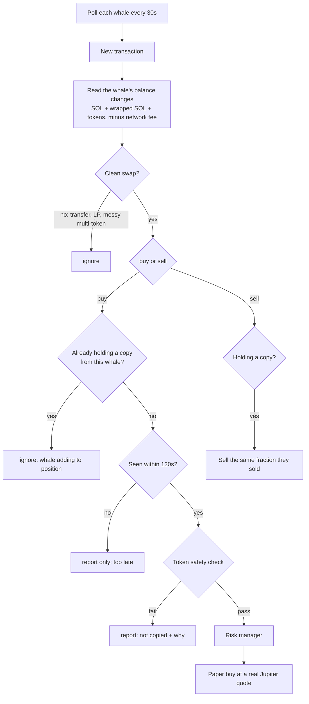
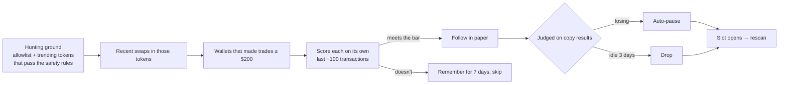

# Whale following

Buttonwood can follow wallets ("whales") and copy their trades into the **paper** account. Each whale is then judged by **your own results from copying it**, not by its past numbers.

> **Read this first.** Most people who copy-trade lose money. By the time a copier sees a trade (seconds to a minute later) the price has often moved, some wallets deliberately sell into their followers, and memecoin wallets mostly trade tokens that go to zero. Buttonwood is built to *measure* whether following a wallet works, and to stop following it when it doesn't.

## How it works



**Reading trades.** For each whale transaction Buttonwood computes the wallet's balance changes (native SOL and wrapped SOL combined, the network fee added back, dust under $1 dropped). Only clean one-in/one-out swaps count. Everything else is ignored rather than guessed.

**One copy per token per whale.** Bots and big wallets often buy in many small pieces. Buttonwood copies the *first* buy and treats the rest as the whale adding to its position. (Tested live: a bot made ~20 buys of one token in two minutes; Buttonwood copied it once.)

**Late buys aren't copied.** After downtime, or if polling falls behind, buys older than `maxCopyDelaySec` (default 120s) are reported but not copied. **Sells are always copied**, because getting out is never too late.

## Token safety check

Before copying any buy of a token that isn't on the built-in allowlist:

| Check | Default | Catches |
|---|---|---|
| Liquidity | ≥ $250,000 | thin pools you can't exit |
| Holders | ≥ 500 | brand-new or fake tokens |
| Age (first pool) | ≥ 24h | fresh launches, most rugs |
| Mint authority disabled | required | creator printing more supply |
| Freeze authority disabled | required | creator freezing your tokens (honeypot) |
| Top holders | ≤ 60% | dumps by insiders |
| **Buy-then-sell quote** | loses < 3% | honeypots and pools you can buy into but not out of |

Verdicts are cached for an hour. Change any threshold with `/copy`.

## Protection on copied positions

- **Copy stop-loss** (default −25%): a whale can hold a coin all the way to zero; you don't have to.
- **Risk manager** applies to every copied buy: max trade size, max % of the portfolio in one token, daily loss limit, buys per hour. Sells are never blocked by these.
- **Auto-pause:** after `autoPauseAfterSells` closed copies (default 5), a whale whose copies lost more than `autoPauseLossPct` (default 5%) of what was spent gets paused, and you get a message. Open copied positions are kept and the stop-loss still applies.

## What /whales shows

```
🟢 alpha 99mR…4F3c
   12 buys, 9 sells · win 56% · net +$4.10 (fees incl.) · 3 skipped
   avg 14s behind them, 0.42% worse price
```

**"worse price"** is the real cost of following: the gap between the whale's own fill (after its network fee) and yours. If that number is larger than the whale's typical gain per trade, copying them can't work, however good they are.

## Autopilot: finding whales automatically

Autopilot is **on by default**. It finds, follows, and replaces whales without you.



**The bar a wallet must clear** (on its own recent history, rebuilt from its transactions):

| | Default | Why |
|---|---|---|
| Completed round trips | ≥ 5 | can't judge fewer |
| Win rate | ≥ 50% | |
| Return on what it sold | ≥ +5% | |
| Median hold time | ≥ 10 min | faster can't be copied with a 30s delay |
| Trades per day | ≤ 60 | more = bot or market maker |
| Round trips in liquid tokens | ≥ 50% | we only buy liquid tokens |

Wallets that pass are ranked by return × win rate × experience × liquidity, and the best fill the open slots (default 5). **A good history only earns a trial.** From then on, a whale is judged on what copying it actually earns.

**Schedule:** a full scan every 24h; open slots are refilled every 8h. A scan takes ~8 minutes and ~3,000 RPC calls.

**Expect it to be picky.** In testing, most active wallets failed: bots trading thousands of times a day, wallets losing money, or too little history. That's the point: the market is full of wallets not worth copying.

**Needs a real RPC.** The public Solana RPC is far too rate-limited for discovery. A free [Helius](https://helius.dev) key works: discovery plus 5 whales polled every 30s fits the free tier.

| Command | |
|---|---|
| `/autopilot` | Status |
| `/autopilot run` | Scan now |
| `/autopilot whales 5` | How many whales to follow |
| `/autopilot off` / `on` | Manual mode / back to automatic |
| `/candidates` | The last scored wallets, with their numbers and why they were rejected |
| `npm run discover` | Dry-run scan from the command line (follows nobody) |

You can still add wallets by hand (`/whale add`). Manual whales are never dropped for inactivity.

## Picking whales by hand

Candidates can come from public top-trader lists (e.g. GMGN, Birdeye, Cielo) or wallets you've watched yourself. Prefer wallets that:

- trade tokens with real liquidity, not only brand-new launches
- hold for minutes to days, not seconds (you can't copy a sniper 30 seconds late)
- make fewer, larger trades

Then let the paper results decide.

## The go-live gate

`/readiness` checks the **paper** record against a fixed bar:

- 14+ days of paper trading
- 30+ trades, 10+ of them closed
- profitable after fees
- beats just holding SOL over the same period
- worst drop from a peak under 15%

The bot messages you once when everything passes. Real-money execution is a separate step that you switch on yourself, starting small.
